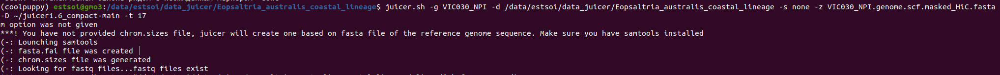
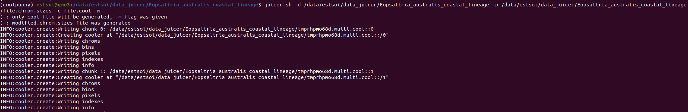

# List of changes:
1) Creation of **.fasta.fai** from **.fasta** and **.chrom.sizes** from **.fasta.fai** was integrated into pipeline. If **-p** flag was not given to the **juicer.sh**, **chrom.sizes** file will be created automaticaly.
   Important note: **samtools** package is required for this to happen

Input example: *just your standart input, but without -p flag* [juicer.sh **-g** Python_molurus_bivittatus-5.0.2 **-d** /data/estsoi/data_juicer/Python_bivittatus **-s** none  
 **-z** /data/estsoi/data_juicer/Python_bivittatus/Python_molurus_bivittatus-5.0.2_HIC.fasta **-D** /home/estsoi/juicer1.6_compact-main **-t** 17]  
 

2) **-c [any_file_name].cool** option creates **.cool** file from **merged_nodups.txt** file at the end of the pipeline  
Important note: **cooler** package is required

input example: [juicer.sh **-g** Python_molurus_bivittatus-5.0.2 **-d** /data/estsoi/data_juicer/Python_bivittatus **-s** none  
**-z** /data/estsoi/data_juicer/Python_bivittatus/Python_molurus_bivittatus-5.0.2_HIC.fasta **-D** /home/estsoi/juicer1.6_compact-main **-t** 17 **-c file.cool**]  

3) **.cool** file can be created from already processed data, final juicer directory. This is what **-m** option is responsible for. **Only -d, -p, -c, -m flags are required**

input example: [ juicer.sh **-d** /data/estsoi/data_juicer/Eopsaltria_australis_coastal_lineage **-p** /data/estsoi/data_juicer/Eopsaltria_australis_coastal_lineage/file.chrom.sizes **-c file.cool -m** ]  

